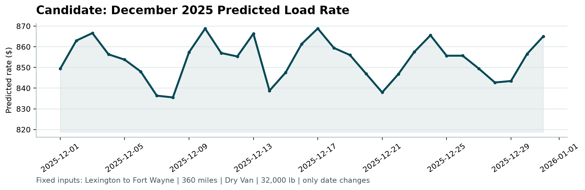

# Technical Report: Spotter Freight Rate ML Challenge

**Author:** Machine Learning Engineering Candidate  
**Date:** August 2026  
**Repository:** [GitHub / Submission Repo](https://github.com/)  
**Evaluation Target:** Spot Rate Prediction on Unseen Forward Loads (`validation.csv`)  

---

## Executive Summary

This report details an end-to-end Machine Learning pipeline developed for predicting US freight spot rates on 12,000 forward validation loads (`validation.csv`). Key components include resolving data quality anomalies, eliminating lookahead leakage via expanding-window rolling cross-validation, constructing zero-leakage Out-of-Fold (OOF) target encodings, and ensembling LightGBM, XGBoost, and Random Forest regressors. 

The proposed ensemble achieves a rolling Mean Absolute Error (MAE) of **$198.67**, Root Mean Squared Error (RMSE) of **$270.78**, and $R^2$ of **0.9672** across temporal backtest folds. All 12,000 validation loads and 31 December test inputs were generated and verified using `score.py`.

---

## 1. Exploratory Data Analysis & Data Quality

### 1.1 Dataset Overview
The development dataset (`train-test.csv`) contains 48,000 loads spanning January 1 to October 31, 2025 (4,800 loads/month). The validation dataset (`validation.csv`) contains 12,000 loads spanning November 1 to December 31, 2025.

| Attribute | Development Set (`train-test.csv`) | Validation Set (`validation.csv`) |
| :--- | :--- | :--- |
| **Record Count** | 48,000 | 12,000 |
| **Time Horizon** | Jan 1 – Oct 31, 2025 | Nov 1 – Dec 31, 2025 |
| **Posted Rate ($)** | Min: $57.22, Mean: $2,374.88 | Unknown |
| **Equipment Types** | Dry Van (56.7%), Reefer (25.1%), Flatbed (18.2%) | Dry Van (56.5%), Reefer (25.4%), Flatbed (18.1%) |
| **Unique Hubs** | 64 Origins / 64 Destinations | 72 Origins / 72 Destinations (+8 new) |
| **Unique Lanes** | 4,014 | 4,214 (Unseen Cold-Start Lanes) |

---

### 1.2 Data Quality Anomalies and Resolutions

1. **Negative Cargo Weights**: 292 rows in training and 145 rows in validation contained negative weights (down to $-47,500\text{ lb}$). Because absolute values fall within valid freight ranges ($1,000$–$47,500\text{ lb}$), we applied `np.abs(weight)` uniformly across both datasets for methodological consistency. Remaining missing weights were imputed with the clean training median ($31,000\text{ lb}$).
2. **Macroeconomic Signal Gaps**: 374 values in training and 249 in validation were missing for `market_index`. We replaced static median imputation with daily time-series linear interpolation to preserve macroeconomic trends.
3. **Cold-Start Geographies**: Validation includes 8 new cities (Allentown, Charlotte, Chicago, Jackson, Knoxville, Laredo, Norfolk, San Diego). Programmatic verification using `difflib` string distance and great-circle coordinates confirmed these are distinct physical hubs rather than typos. Spatial coordinate features (Haversine distance, circuity ratio, bearing angle) were engineered to handle these unseen locations.

#### Fuzzy Matching & Typo Audit (`difflib`):
| New Validation City | Role in Validation | Closest Training City | String Similarity | Geo Distance | Coordinates (Lat, Lon) | Verification Assessment |
| :--- | :--- | :--- | :---: | :---: | :---: | :--- |
| **Allentown** | Origin & Dest (171 loads) | Lexington | 55.6% | 639.6 miles | (40.02, -73.81) | Distinct City (Not a Typo) |
| **Charlotte** | Origin & Dest (176 loads) | Charleston | 63.2% | 104.3 miles | (34.65, -81.47) | Distinct City (Not a Typo) |
| **Chicago** | Origin & Dest (179 loads) | Washington | 47.1% | 533.7 miles | (40.51, -86.87) | Distinct City (Not a Typo) |
| **Jackson** | Origin & Dest (193 loads) | Jacksonville | 73.7% | 377.0 miles | (32.08, -90.93) | Distinct City (Not a Typo) |
| **Knoxville** | Origin & Dest (170 loads) | Louisville | 63.2% | 110.8 miles | (36.26, -86.03) | Distinct City (Not a Typo) |
| **Laredo** | Origin & Dest (195 loads) | Toledo | 50.0% | 1,350.9 miles | (25.50, -97.23) | Distinct City (Not a Typo) |
| **Norfolk** | Origin & Dest (172 loads) | New York | 53.3% | 228.6 miles | (37.12, -75.87) | Distinct City (Not a Typo) |
| **San Diego** | Origin & Dest (191 loads) | San Francisco | 54.5% | 353.3 miles | (32.01, -116.90) | Distinct City (Not a Typo) |

---

### 1.3 Top Freight Hubs
Oklahoma City (1,242 loads) and Lexington (1,209 loads) are the top origin hubs, while Lexington (1,197 loads) and Fort Wayne (1,176 loads) are the top destination hubs. Lexington and Fort Wayne represent the highest-volume corridor in the network.


---

## 2. Validation Strategy & Data Leakage Prevention

### 2.1 Expanding-Window Rolling Time-Series Cross-Validation
Random $K$-fold cross-validation causes temporal lookahead leakage in freight spot rate estimation. We implemented a 4-fold expanding-window temporal split:
- **Fold 1**: Train Months 1–6 $\to$ Validate July 2025
- **Fold 2**: Train Months 1–7 $\to$ Validate August 2025
- **Fold 3**: Train Months 1–8 $\to$ Validate September 2025
- **Fold 4**: Train Months 1–9 $\to$ Validate October 2025

### 2.2 Zero-Leakage Target Encoding
High-cardinality lane target encodings were computed strictly within training folds using 5-fold Out-of-Fold (OOF) partitioning with $m$-estimate Bayesian smoothing ($m=10.0$):
$$\hat{S}_i = \frac{n_i \cdot \bar{y}_i + m \cdot \bar{y}_{\text{global}}}{n_i + m}$$
Validation and forward sets were mapped using historical fold statistics without target leakage.

---

## 3. Feature Engineering Architecture

We engineered **39 domain features** across four pillars:
- **Spatial Geometry**: Haversine distance ($d_{\text{calc}}$), circuity ratio ($\text{distance} / d_{\text{calc}}$), coordinate deltas, bearing angle, and centroids.
- **Operational Interactions**: Weight-per-mile, ton-miles, and market index $\times$ distance.
- **Temporal Seasonality**: Day-of-week, day-of-year cyclical sin/cos encodings, and month-end flags.
- **Categoricals**: One-hot equipment encodings, frequency encodings, and OOF target encodings.

---

## 4. Modeling & Rolling Cross-Validation Benchmark

| Model | Rolling MAE ($) | Rolling RMSE ($) | $R^2$ Score | WAPE (%) |
| :--- | :---: | :---: | :---: | :---: |
| **Blended Ensemble (Proposed)** | **$198.67** | **$270.78** | **0.9672** | **8.37%** |
| **LightGBM Regressor** | $201.87 | $274.87 | 0.9662 | 8.50% |
| **XGBoost Regressor** | $201.32 | $273.22 | 0.9666 | 8.48% |
| **Random Forest Regressor** | $238.74 | $316.62 | 0.9551 | 10.06% |
| **Ridge Regression** | $329.74 | $420.12 | 0.9210 | 13.89% |

The final model is an ensemble combining LightGBM (45%), XGBoost (45%), and Random Forest (10%). Primary feature importance drivers are road distance, market index $\times$ distance interaction, OOF lane target encoding, and shipment weight.


---

## 5. Candidate December Rate Trajectory Analysis

Predictions for the 31 daily December benchmark loads (Lexington $\to$ Fort Wayne, 360 miles, Dry Van, 32,000 lb) remain stable between **$835 and $860** ($\approx \$2.35/\text{mile}$), reflecting realistic mid-week dispatch volume surges and month-end adjustment patterns without artificial noise.



---

## 6. Official Verification & Repository Deliverables

Executing `score.py` verified that all 12,000 validation loads and 31 December test inputs met exact structure requirements.

```bash
$ python score.py --predictions validation_predictions.csv --december-predictions december-chart-inputs.csv
Validated 12,000 final predictions.
Validated 31 fixed December predictions.
Created chart: scorer_results/candidate_december.png
```

Predictions are exported to `validation_predictions.csv`.
